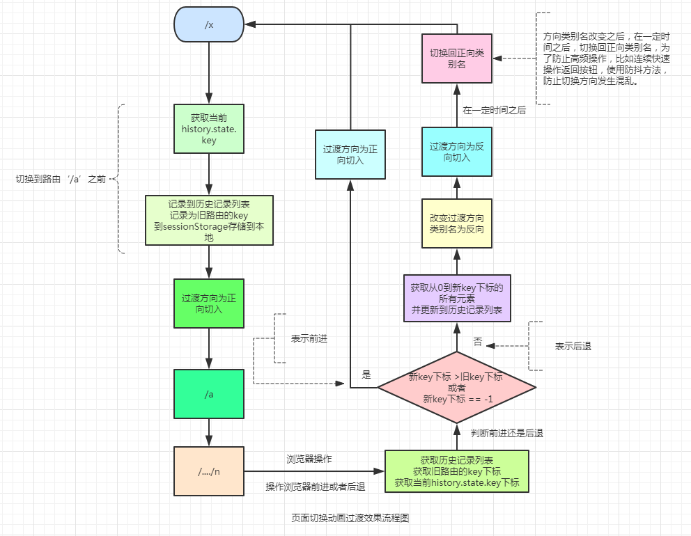

# VUE页面切换动画过渡效果

## Build Setup

``` bash
# install dependencies
npm install

# serve with hot reload at localhost:8080
npm run dev

# build for production with minification
npm run build

# build for production and view the bundle analyzer report
npm run build --report
```

## VUE页面切换动画过渡效果实现

页面切换场景需求描述：

1、当点击页面（除了点击“返回”）路由发生变化，页面切换过渡效果是从左向右滑动；

2、当点击“返回”，页面切换过渡效果是从右向左滑动；

3、当点击浏览器自带“后退”按钮，过渡效果从左向右滑动；当点击浏览器自带“前进”按钮；


### 实现方案

当执行页面操作时，都被视为正向操作，浏览器历史会记录一条新的记录，所以过渡方向始终应该是正向切换方向；

同时我们也会记录当前 `history.state.key` 到历史记录列表数组中，历史记录列表类似浏览器历史会记录一样，记录着浏览的历史顺序。

还把当前目标路由的 `history.state.key` 单独记录下来，作为旧的路由key记录下来。因为相比下一个切换的目标路由，当前目标路由是旧的路由了，主要作用是在触发`popstate`事件时，可以结合历史记录列表，获取到新路由的key和旧路由的`key`的下标，通过判断它们的下标大小，判断是操作了浏览器前进按钮还是后退按钮；

当执行浏览器操作（前进或者后退），根据上述比较新旧路由的`key`在历史记录列表数组中的下标，返回判断它们的下标大小，判断是前进还是后退，再更换更换过渡方向。

实现页面切换 动画过渡效果流程图如下:



### 代码实现

基于当前路由与目标路由的变化关系，通过动态设置过渡效果。

```html
<!-- 使用动态的 transition name -->
<transition :name="`${$store.state.router.direction}`">
    <keep-alive>
        <router-view></router-view>
    </keep-alive>
</transition>

<script>
export default {
    ...
    methods: {
        back() {
            this.$router.go(-1);
        }
    }
}
</script>
```

通过Vuex状态管理，管理过渡名称，过渡效果默认方向为从左向右滑动，设定为默认值`left`。

```js

export default {
  state: {
    direction: 'left',
    ...
  },
  mutations: {
    updateDirection(state, direction) {
      state.direction = direction
    },
    ...
  }
}

```

注册一个全局前置守卫，在有路由切换之前，获取切换到当前目标路由的 `history.state.key`值（`history`对象包含用户（在浏览器窗口中）访问过的 URL，表示浏览器历史记录，`state`属性表示状态对象值，`key`属性值是vue框架随机生成保存的值） ，并保存到本地缓存的 `ROUTER_HISTORY` 数组属性中，作为自己维护的历史记录（这是自己保存的一份路由历史，为了后续可以判断，操作的是浏览器前进按钮还是后退按钮）。

同时把当前目标路由的 `history.state.key` 值保存到本地缓存的 `OLDURLKEY` 属性里面。

```js

router.beforeEach((to, from, next) => {
    let key = history.state ? history.state.key : '0';
    let router_history = storage.getSession('ROUTER_HISTORY') || [];

    //记录路由历史，这里主要记录history.state.key的值
    router_history = [...new Set([...router_history, key.toString()])];
    storage.setSession('ROUTER_HISTORY', router_history);
    //记录当前路由的key，当已经进入页面之后，相对即将切换路由，其为旧的路由key
    storage.setSession('OLDURLKEY', key.toString());

    next();
});

```
当用户操作了浏览器前进或者回退按钮，目前浏览器是没有提供方法或者对象给我们判断用户是操作前进或者回退按钮，但是会触发`window.onpopstate`事件。

所以我们需要结合我们自己维护的`ROUTER_HISTORY`历史记录数组，先获取当前路由的 `history.state.key`值在本地缓存的 `ROUTER_HISTORY` 历史记录数组的下标，和获取旧路由`OLDURLKEY` 属性的值在 `ROUTER_HISTORY` 历史记录数组中的下标。

假设当前路由的 `history.state.key`值没有在历史记录数组或者当前路由的下标大于旧路由的下标，就表示前进。反之为操作看了后退按钮。


```js

//设置过渡的样式名
function setTransitionName(change_time = 600) {
    let new_url_key_index, old_url_key_index;
    let urls = storage.getSession('ROUTER_HISTORY');
    let new_url_key = history.state.key;
    let old_url_key = sessionStorage.getItem('OLDURLKEY');

    if (urls.length > 0) {
        new_url_key_index = urls.indexOf(new_url_key);
        old_url_key_index = urls.indexOf(old_url_key);

        if (new_url_key_index == -1 || new_url_key_index > old_url_key_index) { 
            //前进
            ...
        } else { 
            //后退
            ...
        }
    }
}

try {
    //监控到浏览器历史发生变化
    //该事件只有在做出浏览器动作时，才会触发该事件
    //如用户点击浏览器的回退按钮（或者在Javascript代码中调用history.back()）
    window.onpopstate = e => {
      setTransitionName();
    }
} catch (e) {
    ...
}

```

当操作的是回退按钮，我们需要从历史记录数组把前一个历史记录删除。

因为浏览器历史记录机制是这样的，假设我们当前的访问页面的历史是这样的（A => B => C=> D）当你后退到B页面，再访问E页面，然后历史记录会添加E页面记录，当再你后退一步，后退的访问的页面不是D页面，而是B页面，因此历史记录是这样的（A => B => E）。

所以当后退时，我们需要把前一个历史记录删除，与浏览器历史记录机制一致。

```js

    if (new_url_key_index == -1 || new_url_key_index > old_url_key_index) {
            //前进
            return false;
    } else { 
        //后退
        storage.setSession('ROUTER_HISTORY', urls.slice(0, new_url_key_index));
        store.commit('router/updateDirection', 'right');
        
        //防抖 
        clearTimeout(timer);
        timer = setTimeout(() => {
            store.commit('router/updateDirection', 'left');
        }, change_time);
    }

```

### 遇到的疑问、问题以及解答、解决方案

1、如何判断用户操作了前进还是回退按钮？目前浏览器是没有提供方法或者对象给我们判断用户是操作前进或者回退按钮。

解：自己维护一份`ROUTER_HISTORY`历史记录，获取当前路由的 `history.state.key`值在本地缓存的 `ROUTER_HISTORY` 历史记录数组的下标，和获取旧路由`OLDURLKEY` 属性的值在 `ROUTER_HISTORY` 历史记录数组中的下标。比较其下标大小，如果当前路由的下标大于旧路由的下标，则表示前进，反之为后退。

2、如果从a页面，进入登录页面，登录成功后，跳转到b页面，此时从b页面返回的是登录页面，如何解决？

解：登录成功后，使用路由的代替方法`router.replace()`，`router.replace`跟`history.replace`相似。

3、后退改变过渡方向向右后，在设置变回原来的方向向左，时间内高频率执行操作后退，会出现方向向左。

解：使用函数防抖方法，优化高频率执行的js代码

4、`history.state`是什么，`history.state.key`是怎么生成的？

解：history表示历史记录对象，state属性表示状态对象值
  
当创建一条新的历史记录或者更新一条历史记录时，也就是调用了`pushState`、`replaceState`方法，这两个方法需要三个参数: 一个状态对象, 一个标题 (目前被忽略), 和 (可选的) 一个URL。

而我们这里用到的`history.state.key`就是在状态对象`state`，添加了`key`属性。

5、兼容问题

解：下图为popstate事件兼容情况与transtion属性兼容情况比较图：


